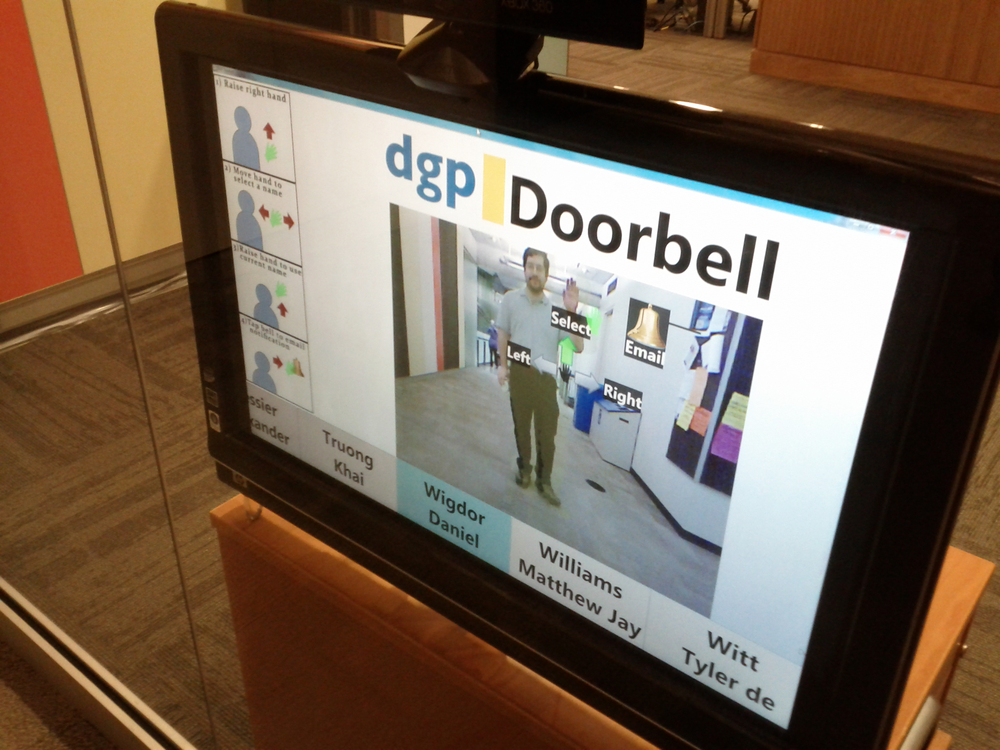

# DGP Doorbell

A Kinect-powered doorbell, which has served at the front entry of DGP (http://www.dgp.toronto.edu/), in The University of Toronto's Department of Computer Science, from 2012 - 2015, and possibly for much longer.

This project was part of our "Hackday Friday" series.

Built in WPF (RIP).

